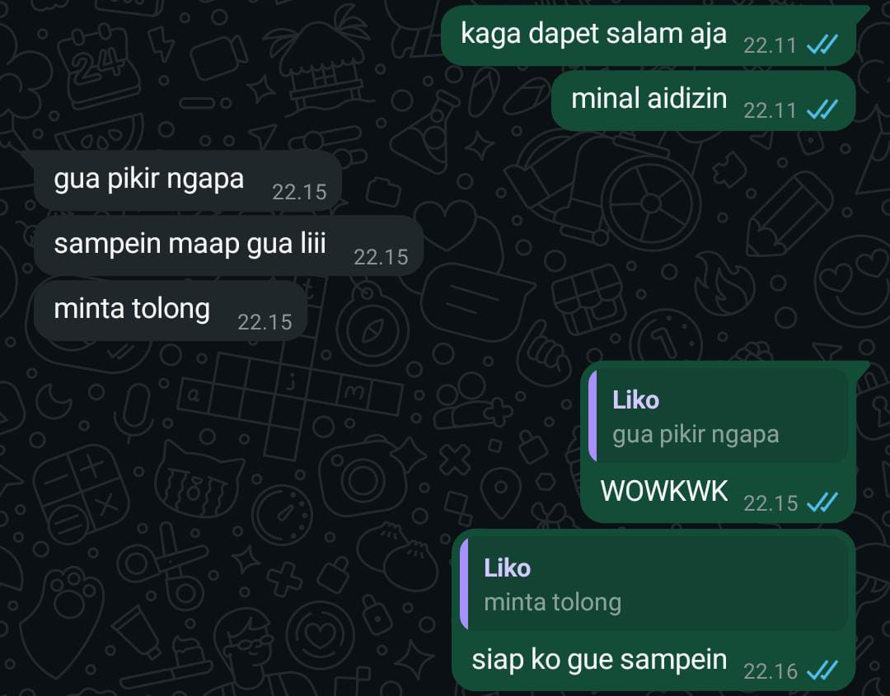

# Website Galeri - Ali Akbar

Website galeri pribadi dengan sentuhan elegan dan modern. Dibuat untuk menampilkan screenshot, cerita, atau kenangan dalam format visual yang menarik.

## Fitur

- Halaman **Welcome** dengan teks pembuka dramatis dan input interaktif (nama dan kebutuhan).
- Halaman **Menu Utama** dengan:
  - Header teks animasi 3D
  - Galeri screenshot dengan efek hover (zoom out & bayangan)
  - Background khusus
  - Musik latar otomatis
  - Footer dengan efek fade-in dan credit elegan

## Cara Menggunakan

1. Clone atau download repositori ini.
2. Buka file `index.html` di browser (disarankan pakai Live Server di PC atau Acode di Android).
3. Masukkan nama & kebutuhan di halaman Welcome untuk lanjut ke galeri.
4. Nikmati tampilan galeri beserta musik latarnya.

## File Penting

- `index.html` : Halaman utama website
- `style.css` : Gaya visual (jika dipisah dari HTML)
- `kuning.mp3` : Lagu latar (Rumahsakit - Kuning)
- `menu-bg.jpg` : Background Menu Utama
- `ss1.jpg`, `ss2.jpg`, `ss3.jpg` : Screenshot galeri

## Preview

## Credit

Website ini dibuat oleh **Ali Akbar** dengan bantuan desain elegan, efek animasi CSS, dan semangat nostalgia.